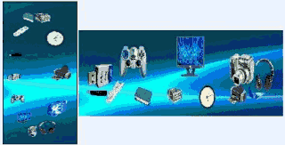



## Roulette Menu

### Description

It is a nice 3D Program for your Desktop.

Allows choise the image and action for each Icone.

4 Roulette types, with Zoom and Stretch features.
 
### More Info
 

             |
---                |---
**Submitted On**   |2011-02-14 05:19:46
**By**             |[Agustin Rodriguez](https://github.com/Planet-Source-Code/PSCIndex/blob/master/ByAuthor/agustin-rodriguez.md)
**Level**          |Intermediate
**User Rating**    |4.9 (39 globes from 8 users)
**Compatibility**  |VB 6\.0
**Category**       |[Custom Controls/ Forms/  Menus](https://github.com/Planet-Source-Code/PSCIndex/blob/master/ByCategory/custom-controls-forms-menus__1-4.md)
**World**          |[Visual Basic](https://github.com/Planet-Source-Code/PSCIndex/blob/master/ByWorld/visual-basic.md)
**Archive File**   |[Roulette\_M2198092152011\.zip](https://github.com/Planet-Source-Code/agustin-rodriguez-roulette-menu__1-73743/archive/master.zip)

